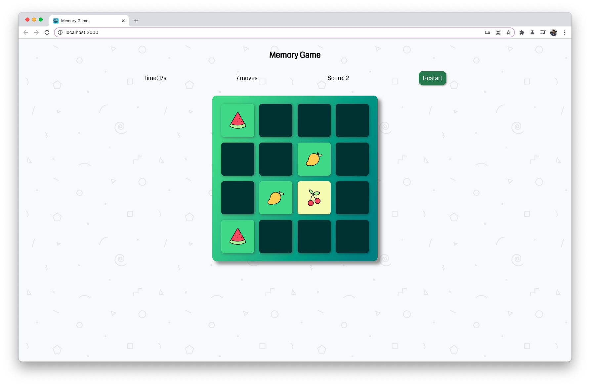

# Memory Game with React

Game finished:

## Colors
- Primary: rgba(96,221,142,1)
- Secondary: rgba(24,138,141,1)
- Gradient from [GradientHunt](https://gradienthunt.com/gradient/22202)

## Steps
You need to break this project into steps and list them down here...
1)create layout
2)create component
  1)Game 
    create timer, game logic
  2)NavBar
  3)End Game with scores with reset and time and moves 
  4)card
  

### Edge cases
- Clicking on the same tile twice
- Clicking on another tile while two tiles that you have selected are visible